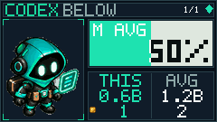

# QuotaDeck v0.2.3 변경 노트

작성일: 2026-09-11
수정일: 2026-09-12

## 이번 변경

- Codex/Claude 로컬 로그와 선택적 `token-stats`/`ccusage` 경계를 사용하는 누적 Usage collector를 추가했습니다.
- 기간별·모델별 토큰 집계와 평균 대비 표시를 추가하고, 근거가 없는 Cursor 토큰 추정은 `N/A`로 제한했습니다.
- Display 비용 환산 행의 좌측 시작점에 7x7 코인 픽셀 아이콘을 추가했습니다.
- 누적 Display 미리보기와 collector 문서를 README 및 `docs/`에 연결했습니다.
- 입력 검증, refresh 안전성, 진단/HTTP 보안 경로와 회귀 테스트를 보강했습니다.

## 2026-09-12 정규화 엔진·LCD 연동

- 리뷰에서 `collect_normalized_usage` Codex 계정 합계가 패치 전 `UsageService` analytics 합계와 일치함을 확인했습니다. Codex 로컬 스캐너의 기존 delta 재조정은 유지했고, Codex 이벤트 롤업은 바꾸지 않았습니다.
- Grok `grok usage` 세션 총계는 계정/제공자/전체 합계에서 증분 롤업 대상이 아닙니다. resume/fork 겹침이 있어 비용은 미지(`None`)로 두고, 계정 전체·일별 원장으로 주장하지 않습니다.
- `CumulativeUsageService` → `QuotaDeckRuntime` → renderer → F108 LCD 누적 경로가 정규화 엔진을 소비합니다. Cursor attributable export의 가상 API 정가(`LIST`)가 키보드에 도달하고, Grok 세션 총계는 일별 THIS/AVG로 올라가지 않습니다.
- 커스텀 엔드포인트 가격은 계속 `N/A`입니다. unknown을 0으로 만들지 않으며 자격 증명은 노출하지 않습니다.

## 2026-09-12 스프라이트 FASTOCTREE 재현성

- `python tools/gen_sprites.py --check`가 이 Windows 호스트와 main CI(`windows-latest`, Pillow 12.3.0)에서 21개 런타임 PNG와 `artwork/sprite_previews/runtime_contact_sheet.png`를 오래된 것으로 표시했습니다. 픽셀 비교를 느슨하게 하지 않았습니다.
- 원인은 원본 시트 나열 순서나 `PYTHONHASHSEED`가 아닙니다. 같은 호스트에서 프로세스·cwd·hash seed를 바꿔도 생성 결과는 같았고, 불일치는 `Image.quantize(FASTOCTREE)`의 libc `qsort`가 occupancy만으로 버킷을 나누기 때문입니다. glibc는 같은 count에서 공간 인덱스를 유지하고 MSVC는 그렇지 않아 팔레트가 갈라집니다.
- 컴파일러는 동일한 octree를 `(-count, spatial-index)` 전순서로 돌립니다. 알고리즘은 Pillow `QuantOctree.c`(Oliver Tonnhofer, MIT)를 이식했으며 LICENSE와 소스에 저작권 고지를 남겼습니다. 커밋된 104개 런타임 PNG·번들 미러·contact sheet는 이 알고리즘과 일치하므로 다시 쓰지 않았습니다. 의도한 LCD 아트는 그대로입니다.
- GitHub Actions `Sprite assets` 단계는 PowerShell이 `python --check`의 종료 코드 1을 무시하고 뒤이은 `git diff`(비기록 검사라 항상 깨끗)로 성공 처리했습니다. `--check` 실패가 단계 실패가 되도록 `$LASTEXITCODE`를 확인합니다.
- `export_crew`/`export_preview`는 픽셀이 같으면 docs PNG 바이트를 다시 쓰지 않습니다. Pillow PNG 인코딩만 다른 경우 CI `git diff -- docs`가 깨지지 않습니다.

## 2026-09-12 Win32 GET_FEATURE 64바이트 ABI

- 연결된 AULA F108 Pro(VID `0C45` PID `800A`)에서 기본 auto/Win32 업로드가 페이지 쓰기 전 `GET_FEATURE short read (64/65 bytes)`로 실패했습니다. 동일 8프레임은 hidapi로 업로드되었습니다.
- 재측정에서 기본 Win32는 count 64여도 raw 접두사가 `00 04 18 00 01 00 00 00`이었습니다. 64바이트가 페이로드만이고 `buffer[0]`부터 데이터라는 가정은 틀렸고, 원래처럼 리포트 ID를 제거해야 ACK가 `byte[3]`에 남습니다.
- Windows `IOCTL_HID_GET_FEATURE`의 65바이트(`00` + 64 페이로드)와 64바이트(`00` + 63 페이로드) 모두 리포트 ID를 제거해 접두사 `04 18 00 01`을 만들고, 64는 부족한 마지막 바이트만 패딩하며, 64 미만 읽기는 거절합니다.
- 수정 후 기본 auto가 선택한 `Win32Transport`로 실기기 재검증을 완료했습니다. 8프레임·520,192바이트의 127개 페이지 ACK와 최종 apply ACK를 확인했으며, 전송·적용에는 약 17.6초가 걸렸습니다. 합성 Cursor export를 사용한 검증이며 실제 계정 청구값 검증은 아닙니다. [상세 기록](docs/WIN32_LCD_VERIFICATION.md)

## 2026-09-12 GUI 시작·Windows 실행 파일

- 표시 정보 콤보박스의 `self.metric` 이름이 Qt의 `QPaintDevice.metric()`을 가려 창 표시·그리기 중 TypeError를 일으키던 문제를 `metric_combo`로 수정했습니다. 격리된 이벤트 루프 회귀 테스트와 새 실행 파일의 기동 로그에서 확인했습니다. [GUI 수정 기록](docs/GUI_STARTUP_FIX.md)
- `dist/QuotaDeck.exe`를 현재 런타임으로 다시 빌드했습니다. Win32 수정본의 실제 앱에서 기존 설정의 계정 3개·24프레임·1,556,480바이트를 전송하고 380개 페이지 및 최종 apply ACK를 확인했습니다. Codex 2개는 `ok`, Cursor는 `stale`였으며 모든 제공자의 실시간 조회 성공을 뜻하지 않습니다.
- GUI 수정 후 USB-C 연결과 24프레임 미리보기 준비도 확인했습니다. 잠긴 Windows 화면 때문에 스크린샷 픽셀과 키보드 LCD의 육안 확인은 검증 범위에 포함하지 않았습니다.

## Display 이미지

실행 시 사용되는 원본 아이콘은 `src/quotadeck/bundled/icons/coin-pixel.png`이며, 240x135 LCD 미리보기는 `docs/cumulative-coin-preview.png`입니다.

## 검증

- 통합본 pytest: **434 passed, 1 skipped, 8 subtests passed** (2026-09-12 GUI·스프라이트 수정 병합 후, 55.07초, 고유 `--basetemp`, cache 비활성)
- 독립 프로세스 `python tools/gen_sprites.py --check` 2회(기본 hash seed, `PYTHONHASHSEED=1`)와 `tools/verify_refresh.py` 통과
- pytest의 검색 경로에 저장소 루트를 명시해 `pytest`와 `python -m pytest` 모두 `tools` 회귀 테스트를 수집하도록 했습니다.
- `export_crew.py` + `export_preview.py` 후 런타임 미리보기 PNG/GIF 바이트 유지 (`git diff -- docs/assets docs/hud-preview.png docs/hero-preview.gif` 깨끗)
- Win32 transport unittest: **19 passed** (관측 count 64 접두사 `00 04 18 00 01`, ACK `byte[3]`, 짧은 읽기 거절 포함)
- `compileall`, 문서/예산/스프라이트/릴리스 검사 통과
- 2026-09-12 Win32 재검증(부모): **428 passed, 1 skipped, 8 subtests passed**. 건너뛴 1건은 Windows 디렉터리 심볼릭 링크 생성 권한이 필요한 테스트입니다.

하드웨어 LCD 전송과 실제 로그인된 외부 CLI 계정의 live Usage 값은 CI에서 검증하지 않습니다.
