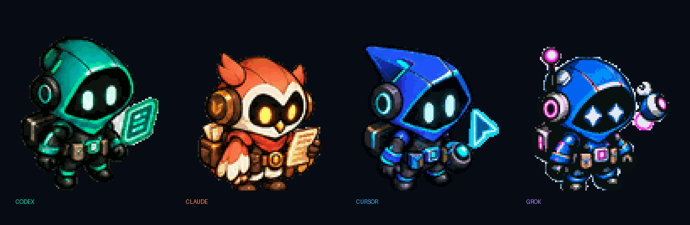
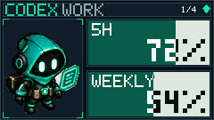
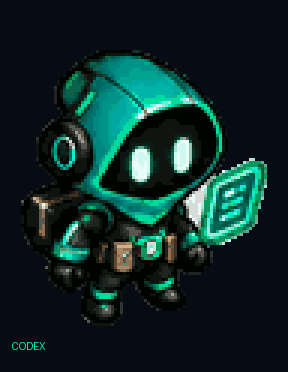
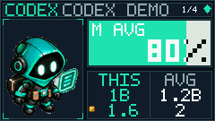

<p align="center">
  <a href="README.md">🇰🇷 한국어</a> · <strong>🇺🇸 English</strong>
</p>

<p align="center">
  
  
  
  
</p>
<p align="center">
  
</p>

<p align="center">
  
</p>

---
# QuotaDeck

QuotaDeck finds AI coding accounts already signed in on this PC (CLI or app),
lets you display either **remaining rate limits** or **cumulative token usage
retained on this device**, and uploads a 240×135 RGB565 playlist to the AULA
F108 Pro LCD. Credentials and conversation content stay with the official CLI
or app.

**v0.2.3:** Review verified that existing Codex local delta reconciliation
already matches UsageService analytics totals; this patch preserves that
path and does not change Codex event rollup. The actual fixes are safe
Grok session-inventory aggregation (not an account ledger) and wiring
the normalized engine into the F108 cumulative LCD path, so Cursor
attributable exports can show hypothetical API `LIST` cost while Grok
session totals stay off the daily THIS/AVG card. The default Win32
transport now treats `GET_FEATURE` counts of 64 and 65 as report-ID
prefixed buffers, drops `buffer[0]` so the payload starts at
`04 18 00 01`, pads only the missing trailing byte for count 64, and
still rejects shorter reads.

On 2026-09-12, the connected F108 Pro accepted 8 frames (520,192 bytes)
through the default Win32 backend, with all 127 page ACKs and the final
apply ACK verified. This check used a synthetic Cursor export, not real
billing data. See the [hardware verification record](docs/WIN32_LCD_VERIFICATION.md).

> New here? Follow **Getting started**. Protocol, themes, and security live under [docs/](docs/).
## Architecture

```
Discovery (CLI / App) → account picker → providers / local history → quota / cumulative snapshot
    → Severity → Scheduler → SceneEngine → Frames
    → RGB565 payload → F108 driver
                 ↘ PNG preview (settings app)
```

The renderer never talks to hardware. `quotadeck render` works without a
keyboard. The settings app picks accounts, displayed metric, language, and
timings. While its tray process runs, it polls automatically and uploads only
when a wired keyboard is ready and the flash safety gates allow it. Uploads
rewrite the keyboard LCD SPI flash. Default: write at most every **10 minutes**.
See **LCD flash life** below.

## Providers and remaining limits

| Provider | Source | Credential | Status |
| --- | --- | --- | --- |
| OpenAI Codex | CLI | `~/.codex`, `CODEX_HOME` | Live |
| Cursor | App / CLI | `state.vscdb` or `auth.json` | Live |
| Anthropic Claude | CLI | `~/.claude/.credentials.json` | Community |
| xAI Grok | CLI | `~/.grok/auth.json` | Community |

The same Cursor user found in both App and CLI is shown once (App first).
<p align="center">
  
  
  
  
</p>
Each account owns the full LCD for exactly the same duration. In remaining-limit
mode, an 88×108 quarter-view character fills the left bay and full-height quota
bars fill the right. Only **5H / WEEKLY / AUTO / OTHER** and a large remaining
percentage stay inside each bar. Text switches from white over the filled side
to black over the depleted side at the live boundary. Cursor prefers **AUTO**
and **OTHER**, falling back to a spend-cents `used/limit` **PLAN** bar only when
those fields are absent.

- 50–100 idle · 20–49 busy · 10–19 caution · 1–9 critical · 0 exhausted
- plus offline / stale / reset

Original pixel art only. No official vendor mascots.

## 0.2 display modes

Choose either mode with **Displayed metric** in the settings window:

<p align="center">
  
</p>

- **Remaining limits** — the existing provider-quota percentages and reset state.
- **Cumulative usage** — a large, selectable daily or monthly `THIS` versus
  `AVG` token comparison, a quota-style usage bar, and conditional API
  list-price equivalents for the same selected period.

Cumulative mode observes history retained by the **current local profile/device**;
it is not an account-wide billing ledger. The analyzer can report up to 365
retained days when that history really exists, but the LCD deliberately omits
retained-total/span labels and model names to keep the 240×135 screen readable.
If no valid in-window observations exist, the result is `N/A` rather than a
fabricated measured zero.

| Service | Cumulative source | Local retained analysis | Selected-period LCD cost |
| --- | --- | --- | --- |
| Codex | Local `sessions` and `archived_sessions` JSONL | Supported | Hypothetical API `LIST` (API-key or subscription; not reported spend). Custom endpoints stay `N/A` |
| Claude Code | Local `projects/**/*.jsonl` response metadata | Supported | Hypothetical API `LIST` (API-key or subscription; not reported spend). Custom endpoints stay `N/A` |
| Cursor | N/A unless an attributable token-stats / server Usage export exists | Conditional | Hypothetical API `LIST` when an attributable export exists; never mixed with reported spend |
| Grok Build | `grok usage` exposes individual session totals only | Account card is N/A by default; daily analysis is conditional on separately supplied, retained external OTel v1 events | Session totals are not shown as daily THIS/AVG |

Cursor still requires an admin ledger or a trustworthy export for account
scope. 0.2.3 never invents Cursor tokens from `state.vscdb`; it enables the
card only from collector data that already has account and time attribution.
token-stats is the preferred optional collector, native Codex/Claude parsers
are the fallback, and ccusage is a validation/fallback boundary. Installation
is optional. Grok resume/fork histories can overlap, so QuotaDeck does not sum
sessions or treat `updatedAt` as a usage date. See the
[cumulative-usage contract](docs/CUMULATIVE_USAGE.md) and
[COLLECTORS.md](docs/COLLECTORS.md).

The comparison period is selected in the settings app:

- **Daily** — `THIS` is today's calendar-day tokens; `AVG` is the average of
  prior completed calendar days. At least seven completed days are required;
  empty days after retained history begins count as zero, while prehistory is
  never invented.
- **Monthly** — `THIS` is the current calendar month's month-to-date tokens;
  `AVG` is the average of prior completed calendar months. At least one complete
  prior month is required. A first month retained only in part is excluded;
  later empty completed months are included as zero.

The LCD reuses the remaining-limit bar concept. Its numeric value is
`THIS tokens / AVG tokens × 100`; the fill saturates at 100% while the label
continues through `150%`, `200%`, and `300%+`. Beneath it, two large columns show
`THIS` and `AVG`, first as tokens and then as selected-period cost. A small
transparent pixel coin sits at the left start of the cost row. Both token
values use one shared compact unit (for example `0.6B / 1.2B`). Cost pairs also
use ASCII `K/M/B`, such as `1K / 2K` when the GUI is set to **KRW (10,000 won)**
or `0.4K / 0.8K` in USD. The normal bar caption contains only the period and
baseline (`M AVG` or `D AVG`); the LCD intentionally omits currency labels and
Hangul. Insufficient history, partial history, and an
unavailable ledger instead show `M/D BUILD`, `M/D PARTIAL`, and `M/D N/A`.
Model names never appear on the LCD. The desktop account row shows the top two
models for the selected period, and its tooltip contains the full model list.

For the KRW setting, amounts are measured in units of 10,000 won. The GUI shows
the scale legend: `1K = 10 million won · 1M = 10 billion won · 1B = 10 trillion
won`.

Once the selected period has enough completed history, the same character
reacts with five surprise states:

| THIS ÷ selected-period average | Character reaction |
| ---: | --- |
| `< 1.0×` | Calm |
| `1.0× – < 1.5×` | Mildly surprised |
| `1.5× – < 2.0×` | Clearly startled |
| `2.0× – < 3.0×` | Dramatically shocked |
| `≥ 3.0×` | Comically collapsed |

Cost uses the bundled snapshot of official API list prices dated 2026-09-11.
Choose **KRW** or **USD** in settings. KRW conversion uses the manually entered
rate (default **1,400 KRW/USD**) on the LCD path; `quotadeck usage-engine`
can also apply a fetched Treasury quote with last-known-good then manual
fallback. `THIS` and `AVG` are independently calculated from the
actual model/token mix in those periods, but the pair is all-or-nothing: if
either side cannot be priced completely, both are `N/A`. These are list-price
equivalents of observed tokens, not actual spend or an invoice; the current
API-key signal does not prove each historical session's billing route.
`quotadeck prices` includes snapshot rows for OpenAI, Anthropic, Cursor, and
xAI; a reference price row does not mean that an account usage ledger is
implemented for that service.
It is not a live price lookup. A custom endpoint, an unknown model/token
category, or partial history makes the entire amount `N/A`; QuotaDeck never
displays a misleading partial price. Subscription history may show the same
hypothetical `LIST` equivalent when coverage is complete.

## Getting started (Windows 11)

### Windows exe

A release may provide `QuotaDeck.exe` for use without Python. This UX-refresh
source handoff intentionally excludes an unverified binary: run from source
below, or build a fresh exe from `QuotaDeck.spec` after validation on Windows.
An older upstream exe does not contain these changes.

1. Connect the F108 Pro over **USB-C** and press `Fn+4`.
2. Close official AULA software.
3. Sign in to the providers you want on this PC (CLI or app).
4. Run `QuotaDeck.exe`, pick accounts, then **Upload now**.
5. Switch language with **EN** / **한** in the top-right.

### From source

```powershell
py -3.12 -m venv .venv
.\.venv\Scripts\python.exe -m pip install -e ".[dev]"
.\.venv\Scripts\python.exe tools\gen_sprites.py
.\.venv\Scripts\python.exe -m quotadeck ui
```

In the settings app:

- **EN / 한** — switch the UI language. The choice is saved.
- **Displayed metric** — choose **Remaining limits** or **Cumulative usage**.
  **Save** or **Preview** applies the choice to the running monitor.
- **Comparison period** — in cumulative mode, choose **Daily** (today / prior
  completed-day average) or **Monthly** (month-to-date / prior completed-month
  average).
- **Cost currency** — choose **KRW (10,000 won)** or **USD**. KRW uses the
  editable manual exchange rate, which defaults to 1,400 KRW/USD and is never
  fetched live. The KRW K/M/B scale legend is shown directly in settings.
- **Detect** — rescan CLI/app logins on this PC.
- Checkboxes — only checked accounts rotate on the LCD. The alias is what the HUD shows.
- **Preview** — the selected remaining/cumulative HUD without writing flash.
  Every account rotates for the configured time per account.
- **Upload now** — write the selected accounts to the F108 Pro **user GIF slot**. Buttons lock while the transfer is running.

The current settings schema is **config v5**. It persists
`cumulative_period`, `cost_currency`, and `usd_to_krw_rate`; older settings are
migrated safely, with Monthly, KRW, and 1,400 KRW/USD used when those fields are
missing.

Default timings are **60 seconds / 5 seconds / 10 minutes**. They are not the same clock.

| Setting | Default | What it does |
| --- | --- | --- |
| **Usage poll** | 60 s | How often this PC re-reads provider APIs or local history. This count is not the flash-write count. |
| **Time per account** | 5 s | Total full-screen time, including character animation. Configurable in the app. |
| **Keyboard write** | 10 min | Minimum interval before rewriting onboard storage. |

New settings, or settings without the field, default to 5 seconds. Upgrades
preserve an existing `scene_hold_seconds` value from 2–20 seconds, so change an
older 4 s/10 s value to 5 s once in the app if that is the cadence you want.

While the tray app runs, it polls automatically at this cadence. After a poll,
it writes only when the rendered data changed or aged and the separate minimum
write interval and persisted daily safety cap allow it. With no wired keyboard,
it keeps the on-screen/tray preview current without attempting a device write.

### If the tray disappears

Every GUI run creates rotating diagnostic logs. Use **Open diagnostic logs** in
the tray menu. If the icon has already disappeared, press `Win+R` and open:

```text
%APPDATA%\QuotaDeck\logs
```

Inspect the newest `quotadeck-ui-*.log` and its same-session `*-crash.log`.
A normal exit ends with `event=process_end clean=true reason='tray_quit'`.
If the normal log directory is not writable, QuotaDeck falls back to
`%TEMP%\QuotaDeck\logs`. See the [tray diagnostics guide](docs/TRAY_DIAGNOSTICS.md)
for event meanings and what to share.
This hardening also fixes a live-`QThread` reference race and 64-bit Win32 HID
HANDLE truncation, and gives LCD ACK waits an enforceable timeout.

### CLI

```powershell
.\.venv\Scripts\python.exe -m quotadeck probe
.\.venv\Scripts\python.exe -m quotadeck detect --apply
.\.venv\Scripts\python.exe -m quotadeck usage
.\.venv\Scripts\python.exe -m quotadeck usage --cumulative --models
.\.venv\Scripts\python.exe -m quotadeck cumulative --models
.\.venv\Scripts\python.exe -m quotadeck prices
.\.venv\Scripts\python.exe -m quotadeck prices --provider codex --model gpt-5.6-sol
.\.venv\Scripts\python.exe -m quotadeck render --fixture tests\fixtures\usage.json --out preview.gif --hold-seconds 5 --mode fixed
.\.venv\Scripts\python.exe -m quotadeck run --once
.\.venv\Scripts\python.exe -m quotadeck ui
```

## LCD flash life

Each keyboard upload erases and rewrites the LCD GIF slot on SPI flash. Consumer SPI NOR is typically rated around **100,000** program/erase cycles. AULA does not publish the F108 Pro chip rating, so the numbers below are estimates against that common rating.

The default **minimum upload interval is 10 minutes**. At 16 hours/day that is
6 writes/hour, **about 96 writes/day**. The uncapped interval upper bound
includes the immediate first write opportunity and is
`ceil(960 minutes / minimum interval)`; it is independent of provider polling.
Thus a non-divisible 7-minute interval is **138**, not 137, writes/day.

| Minimum interval | Interval upper bound / day (16h) | Life at 100k cycles |
| --- | --- | --- |
| **10 min (default)** | ~96 | **~2.9 years** |
| 7 min | ~138 | ~2.0 years |
| 30 min | ~32 | ~8.6 years |
| 60 min | ~16 | ~17 years |
| 1 min | ~960 | ~3.4 months |

The default 100-write daily safety counter and conservative **pre-write
reservation** are atomically persisted in `flash-state.json`. An interprocess
lock serializes the decision through device transfer across app/CLI instances,
and the state survives restarts and runtime recreation. A failed or interrupted
transfer may retain one safety count because flash could have been partly
written. The table and settings-window life
estimate use the conservative uncapped interval bound; with the default cap, the
7-minute example can actually write at most 100 times/day. **Upload now** may
bypass the minimum interval, but it does not bypass the daily cap.
If the quantized usage snapshot does not change, QuotaDeck skips the upload, so
real writes can be lower. The table is the **uncapped period upper bound**; the
persisted safety cap lowers it when necessary (for example, 1 minute is still
limited to 100 actual writes/day by default).

> **Warning: refreshing too often shortens the keyboard's onboard storage life.** Keep the 10-minute default. Repeated **Upload now** clicks also wear the same slot.

## Rules

- Never copy tokens into the repo or `config.json`.
- Local history is not an account invoice. Reusing one profile with another
  login or API key can mix retained records.
- Never upload more than 141 frames. The firmware does not enforce the slot; overflow corrupts menu graphics.
- Write the user GIF slot (`image_number = 1`). Slot 0 is the factory GIF.
- USB-C wired mode only (`Fn+4`).
- Do not write flash faster than needed. The default is 10 minutes. Faster intervals reduce lifespan.

## More

[UX refresh and code review](docs/UX_REFRESH_REVIEW.md) · [Cumulative usage](docs/CUMULATIVE_USAGE.md) · [Tray diagnostics](docs/TRAY_DIAGNOSTICS.md) · [Architecture](docs/ARCHITECTURE.md) · [Providers](docs/PROVIDERS.md) · [Security](docs/SECURITY.md) · [F108 protocol](docs/F108_PROTOCOL.md) · [Themes](docs/THEMES.md)

MIT. Protocol notes derived from [parsiya/f108-pro](https://github.com/parsiya/f108-pro) (MIT).
