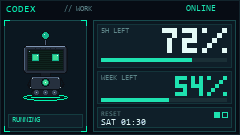

# QuotaDeck

**내 PC에 로그인된 AI 계정의 Rate Limit을 AULA F108 Pro 키보드 LCD에 보여 줍니다.**

QuotaDeck은 이미 이 컴퓨터에 로그인된 Codex / Cursor / Claude / Grok 계정을 찾고, 선택한 계정의 남은 사용량을 240×135 픽셀 아트 HUD로 렌더한 뒤 F108 Pro에 올립니다. 토큰은 복사하지 않습니다. 공식 CLI나 앱이 들고 있는 로그인만 읽습니다.



## 지원 계정

| 제공자 | 찾는 로그인 | 상태 |
| --- | --- | --- |
| OpenAI Codex | Codex CLI (`~/.codex`, `CODEX_HOME`) | Live |
| Cursor | Cursor 앱 (`state.vscdb`) 또는 Cursor CLI (`auth.json`) | Live |
| Anthropic Claude | Claude Code (`~/.claude/.credentials.json`) | Community |
| xAI Grok | Grok Build CLI (`~/.grok/auth.json`) | Community |

같은 Cursor 사용자가 앱과 CLI에 모두 있으면 앱을 우선해 한 줄로 보여 줍니다. 다른 계정이면 둘 다 선택할 수 있습니다.

## 사용 방법 (Windows 11)

1. F108 Pro를 **USB-C 유선**으로 연결하고 `Fn+4`를 누릅니다.
2. 공식 AULA 프로그램이 켜져 있으면 종료합니다.
3. 보고 싶은 제공자에 이 PC에서 한 번 로그인합니다 (CLI 또는 앱).
4. QuotaDeck을 실행해 계정을 고른 뒤 키보드에 올립니다.

```powershell
py -3.12 -m venv .venv
.\.venv\Scripts\pip install -e ".[dev]"
python tools\gen_sprites.py
quotadeck ui
```

설정 앱에서:

- **계정 다시 찾기** — 이 PC의 CLI/앱 로그인을 다시 스캔합니다.
- 체크박스 — 키보드에 올릴 계정만 켭니다. 별명은 LCD에 표시됩니다.
- **미리보기** — 업로드 없이 남은 %와 HUD를 확인합니다.
- **지금 키보드에 올리기** — 선택한 계정을 F108 Pro에 기록합니다.

트레이로 숨긴 뒤에도 폴링이 이어집니다. `Windows 시작 시 실행`을 켜면 부팅 후 자동으로 뜹니다.

## CLI

```powershell
quotadeck probe
quotadeck clock
quotadeck detect
quotadeck detect --apply
quotadeck usage
quotadeck render --fixture tests\fixtures\usage.json --out preview.gif
quotadeck run --once
quotadeck ui
```

`detect` + `Apply` 이후 `quotadeck run`은 양자화된 스냅샷이 바뀔 때만 플래시에 씁니다.

## 화면

한 계정이 LCD 전체를 씁니다. 왼쪽은 캐릭터, 오른쪽은 남은 % / 주간 / 리셋 시각입니다.

- 50–100 idle · 20–49 busy · 10–19 caution · 1–9 critical · 0 exhausted
- plus offline / stale / reset

테마는 `themes/`에 있습니다. 공식 벤더 마스코트는 넣지 않습니다.

## 안전

F108 펌웨어는 141프레임 GIF 슬롯을 **강제하지 않습니다**. 141장을 넘기면 온보드 메뉴 그래픽이 영구적으로 깨질 수 있습니다. QuotaDeck은 잘못된 크기·장수 업로드를 거부하며 우회 플래그가 없습니다.

업로드는 SPI 플래시를 다시 씁니다. 기본 정책: 최소 10분 간격, 최대 60분 경과 시 갱신, 하루 100회.

USB-C 유선(`Fn+4`)만 지원합니다. 업로드 전에 공식 AULA 소프트웨어를 끄세요.

자세한 내용은 [docs/ARCHITECTURE.md](docs/ARCHITECTURE.md), [docs/PROVIDERS.md](docs/PROVIDERS.md), [docs/SECURITY.md](docs/SECURITY.md), [docs/F108_PROTOCOL.md](docs/F108_PROTOCOL.md)를 보세요.

---

## English

QuotaDeck finds AI coding accounts already signed in on this PC (CLI or app), lets you pick which ones to show, and uploads a 240×135 RGB565 playlist to the AULA F108 Pro LCD. Remaining percent is the hero number. Tokens stay with the official CLI/app.

MIT. Protocol notes derived from [parsiya/f108-pro](https://github.com/parsiya/f108-pro) (MIT).
Usage patterns informed by CodexBar, openusage, and pane. Do not copy unlicensed sources.
